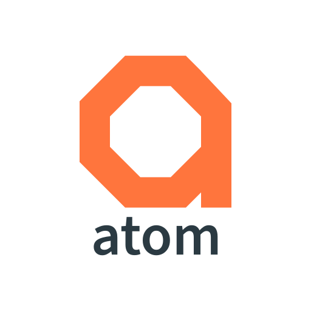

# Atom (⚛)

Atom is a novel intermediate representation for applications and a standalone tool powered by the [chen](https://github.com/AppThreat/chen) library. The intermediate representation (a network with nodes and links) is optimized for operations typically used for application analytics and machine learning, including [slicing](static/img/slices.md) and vectoring.

Our vision is to make atom useful for many use cases such as:

- **Supply-chain analysis:** Generate evidence of external library usage including the flow of data from sources to sinks. Atom is used by [OWASP cdxgen](https://github.com/CycloneDX/cdxgen) to improve the precision and comprehensiveness of the generated CycloneDX document.
- **Vulnerability analysis:** Describe vulnerabilities with evidence of affected symbols, call paths, and data-flows. Enable variant and [reachability analysis](https://github.com/AppThreat/atom/blob/main/specification/docs/slices.md#reachables-slice) at scale.
- **Exploit prediction:** Predict exploits using precise representations of vulnerabilities, libraries, and applications.
- **Threat-model and attack vectors generation:** Generate precise threat models and attack vectors for applications at scale.
- **Application context detection:** Generate context useful for summarization and risk-profile generation (e.g. services, endpoints, and data attributes).
- **Mind-maps for applications:** Automate summarization of large and complex applications as a developer tool.

and more.

