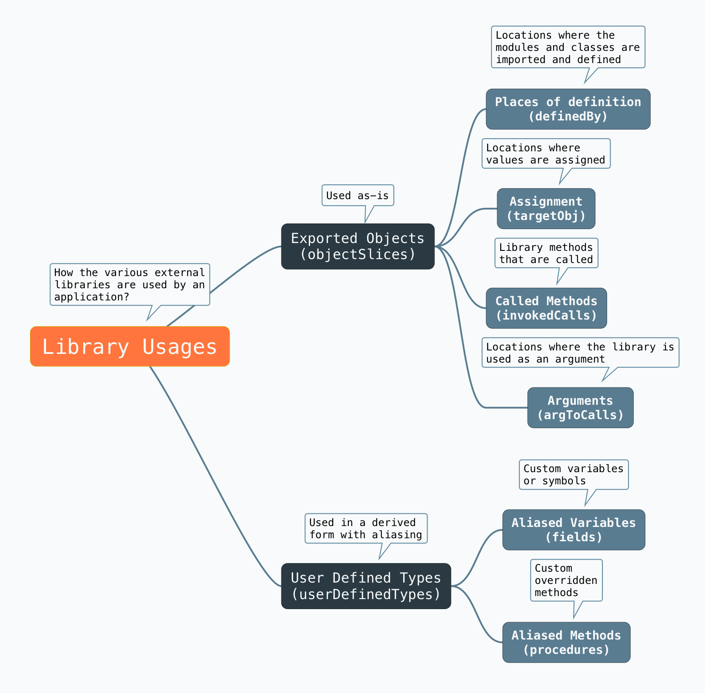
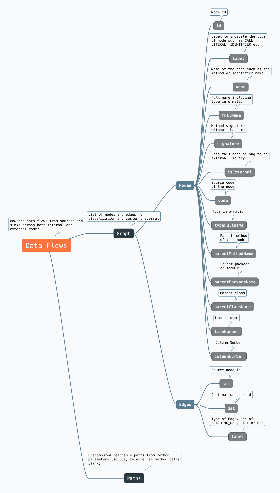
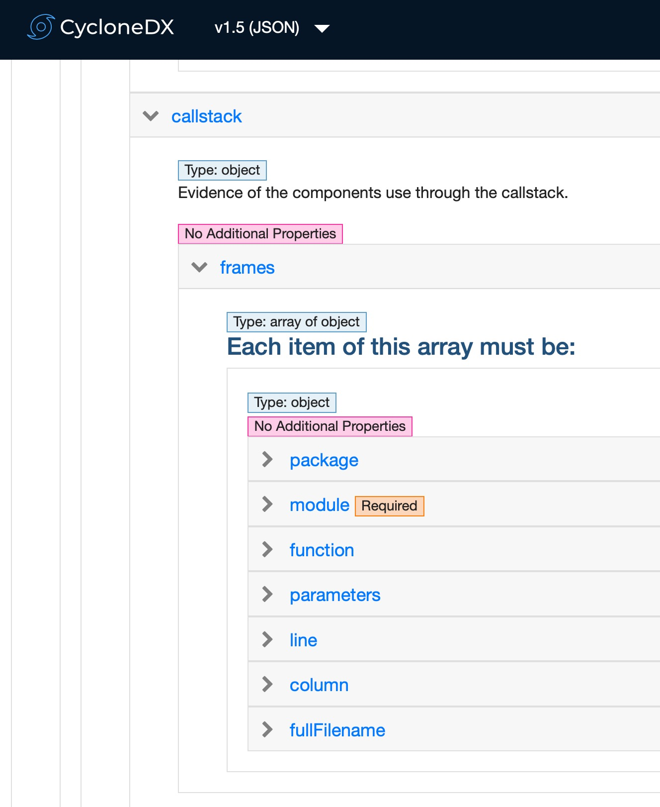

# Introduction

Program slicing is a technique to extract parts of a program based on a criterion. Atom (powered by chen library) is a
static opinionated data flow slicer optimized for application and dependency analysis use cases with up to 100K LOC.

## Design principles

- **Precise** - With static analysis, atom can generate precise slices with verifiable location information from the
  application source code.
- **Non-deterministic** - The slicing operation is optimized for constant-time generation performance and therefore
  non-deterministic. Repeated runs could yield slightly varying results depending on code complexity.
- **Secure** - It is not possible to reverse-engineer and obtain the application source code from the atom slices alone.

All slices produce machine-readable json output that can be parsed using atom [proto specification](specification/atomproto).

## Types of slicing

### Usages slice

Usage slices can help answer two key questions about the usages of external libraries.

1. **HOW?** Are the libraries used as-is or via custom alias or derived type?
2. **WHERE?** File and line number locations of the definitions, imports, usage, calls etc.

The mind map below offers an overview.



#### How to parse?

1. Parse the usages json.
2. Iterate over the `objectSlices` array. For each slice store its fileName and lineNumber.

```json
{
  "objectSlices": [
    {
      "code": "",
      "fullName": "com.example.vulnspring.WebController.jwt:java.lang.String(javax.servlet.http.HttpSession,org.springframework.ui.Model)",
      "signature": "java.lang.String(javax.servlet.http.HttpSession,org.springframework.ui.Model)",
      "fileName": "src/main/java/com/example/vulnspring/WebController.java",
      "lineNumber": 274,
      "columnNumber": 2,
      "usages": [
        {
          "targetObj": {
            "name": "username",
            "typeFullName": "java.lang.String",
            "lineNumber": 276,
            "columnNumber": 3,
            "label": "LOCAL"
          },

```

3. Iterate over the `usages` array. The attributes `typeFullName` (found in `targetObj`
   and `definedBy`) and `resolvedMethod` (`invokedCalls` and `argToCalls`) under each category are of interest.

4. Iterate over the `userDefinedTypes` array. Note the `fileName` and `lineNumber` for each type. For each `field`,
   the attribute `typeFullName` indicates the aliased field. For each `procedure`, the `paramTypes` array lists the
   custom type from index 1 onward.

```json
"userDefinedTypes": [
  {
    "name": "com.example.vulnspring.WebController",
    "fields": [
    {
      "name": "jdbcTemplate",
      "typeFullName": "org.springframework.jdbc.core.JdbcTemplate",
      "lineNumber" : 42,
      "columnNumber": 15,
      "label": "LOCAL"
    },
    {
      "name": "logger",
      "typeFullName": "org.slf4j.Logger",
      "lineNumber": 44,
      "columnNumber": 30,
      "label" : "LOCAL"
    }
    ],
    "procedures": [
    {
      "callName": "home",
      "resolvedMethod": "com.example.vulnspring.WebController.home:java.lang.String(org.springframework.ui.Model,javax.servlet.http.HttpSession)",
      "paramTypes" : [
        "com.example.vulnspring.WebController",
        "org.springframework.ui.Model",
        "javax.servlet.http.HttpSession"
      ],
    "returnType": "java.lang.String",
    "lineNumber": 46,
    "columnNumber": 2
    },
```

### Data flow slice

Data flow slices represent the data-dependency information computed statically from the source code using Reverse-Reachability Algorithm. The full list of `nodes` and `edges` from the
Data Dependency Graph (DDG) is also made available for custom visualization and traversal purposes. Up to 50 reachable
paths are precomputed and made available via the `paths` attribute in the json by the atom cli tool for convenience.



#### When to use?

It is quite common for organizations to have common libraries and modules in separate repositories, jar files, and other packages. These modules would use external libraries as sinks and might lack any entrypoints (sources). Data flow slicing could work well in theses scenarios where the entrypoints (sources) cannot be identified. The brute-force nature means data-flow slicing would often take significant amount of time compared to usages or reachables slicing.

#### How to parse?

1. Parse the data flow json.
2. Iterate over the `graph.nodes` array and create a Map for each node with the id as the key and the node as the value.
3. Iterate over the `paths` array. For each id, look up the node from the map object created in step 2.
4. Filter any operator calls where the name starts with `<operator`. Note that operator calls could start with
   either `<operator>` or `<operators>` (with an `s`) due to a known unresolved bug.
5. All `CALL` nodes with `isExternal=true` indicates external method calls. The `fullName` property is interesting for
   such external calls along with all the `parent*` attributes such as `parentFileName`, `parentMethodName` etc.
6. Nodes with the label `METHOD_PARAMETER_IN` are method parameters. These could be user-provided input depending on the
   framework and filename. For instance, method parameters in a controller or service class usually takes input from the
   users or another service.

#### Mapping data flow slices to CycloneDX 1.5

The information in a data-flow slice can be used as component evidence in a CycloneDX 1.5 document.



| Data Flow Slice Attribute | CycloneDX Attribute | Comments                                                |
| ------------------------- | ------------------- | ------------------------------------------------------- |
| parentPackageName         | package             | Will be based on the filename for Javascript/Typescript |
| parentClassName           | module              | Will be based on the filename for Javascript/Typescript |
| parentMethodName          | function            |                                                         |
| parentMethodSignature     | parameters          | Could be customized to ignore return types              |
| lineNumber                | line                | Could be unavailable for certain projects               |
| columnNumber              | column              | Could be unavailable for certain projects               |
| parentFileName            | fullFilename        |                                                         |

### Reachables slice

Reachables represent data flows that can originate from an entrypoint (source) and reach an external sink. These potentially represent the paths an adversary could take to reach and exploit a known vulnerability in a third-party library and hence the terms "reachable flows" or "Forward-Reachability". With atom, reachable slices can be generated for Java, Jars, JavaScript, and TypeScript applications.

A necessary pre-requisite is the presence of the Software Bill-of-Materials (SBOM) file in the directory containing the source code. At present, only the SBOM generated by [CycloneDX Generator](https://github.com/CycloneDX/cdxgen) have the precision and depth required for computing reachables.

#### How to parse?

1. Parse the reachables json.
2. Iterate over the `reachables` array. Each item in this array is an object containing flows (Reachable data-flows) and purls (List of [Package URLs](https://github.com/package-url/purl-spec))
3. Each item in the flows array is of type `node` similar to the nodes array in the data flow slice above.
4. Each item in the purls array is of type string

```json
{
  "reachables": [
    {
      "flows": [
        {
          "id": 44,
          "label": "METHOD_PARAMETER_IN",
          "name": "this",
          "fullName": "",
          "signature": "",
          "isExternal": false,
          "code": "this",
          "typeFullName": "com.example.SpringKafkaDemo.config.KafkaConsumerConfig",
          "parentMethodName": "consumerFactory",
          "parentMethodSignature": "org.springframework.kafka.core.ConsumerFactory()",
          "parentFileName": "src/main/java/com/example/SpringKafkaDemo/config/KafkaConsumerConfig.java",
          "parentPackageName": "com.example.SpringKafkaDemo.config",
          "parentClassName": "com.example.SpringKafkaDemo.config.KafkaConsumerConfig",
          "lineNumber": 36,
          "columnNumber": null,
          "tags": "framework-input"
        }
      ],
      "purls": [
        "pkg:maven/org.springframework.kafka/spring-kafka@2.8.11?type=jar"
      ]
    }
  ]
}
```

## Generate slices

Use the atom cli to generate slices.

### Create a reachables slice for a java project.

```shell
cdxgen -t java --deep -o bom.json .
atom reachables -o app.atom --slice-outfile df.json -l java .
```

### Create a data flow slice for a java project.

```shell
atom data-flow -o app.atom --slice-outfile df.json -l java .
```

### Create a usages slice for a java project.

```shell
atom usages -o app.atom --slice-outfile usages.json -l java .
```

## Develop a custom slicer

Planned for 2.0.0 release